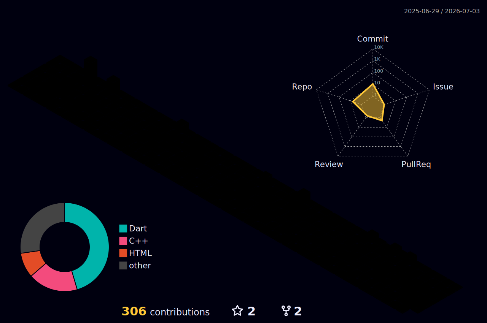

<!-- ====================== HEADER ====================== -->
<a href="https://sagepartners.vc/portfolio/archit">
  
</a>

<!-- ====================== TYPING ====================== -->
<p align="center">
  <a href="https://git.io/typing-svg">
    
  </a>
</p>

<!-- ====================== BADGES ====================== -->
<p align="center">
  <a href="https://sagepartners.vc/portfolio/archit"></a>
  <a href="https://sagepartners.vc/archit-lal-resume.pdf"></a>
  <a href="mailto:lal00020@umn.edu"></a>
  <a href="#"></a>
  <a href="#"></a>
  
</p>

---

<!-- ====================== ABOUT ====================== -->
###  `whoami`

```python
class Archit:
    def __init__(self):
        self.age      = 20
        self.location = "Minneapolis, MN"          # grew up in India 🇮🇳
        self.studies  = "B.S. Computer Science @ UMN"  # expected May 2027
        self.roles    = ["General Partner @ Atland Ventures",
                         "Co-Founder @ 0→1 Startup Accelerator",
                         "Builder / Founder"]
        self.thesis   = "infrastructure for more natural ways to interact with tech"

    @property
    def status(self):
        return "turning TODOs into companies"
```

---

<!-- ====================== FEATURED WINS ====================== -->
### 🏆 `git log --oneline --grep="win"`

<table>
  <tr>
    <td align="center" width="20%"><b>💸 6-figure ARR</b><br/><sub>scaled <a href="https://geteventful.com">geteventful.com</a> in one summer</sub></td>
    <td align="center" width="20%"><b>$175K deployed</b><br/><sub>across 7 seed-stage startups</sub></td>
    <td align="center" width="20%"><b>200+ startups</b><br/><sub>evaluated as a GP</sub></td>
    <td align="center" width="20%"><b>YC Demo Days</b><br/><sub>youngest investor selected</sub></td>
    <td align="center" width="20%"><b>$16.5K raised</b><br/><sub>for Altivis</sub></td>
  </tr>
</table>

---

<!-- ====================== EXPERIENCE ====================== -->
### 💼 `cat ~/experience.log`

- **General Partner** — *Atland Ventures* · Jan 2025–Present
  <br/><sub>Source 10+ startups/week · led evaluation of 200+ seed-stage companies · $175K deployed across 7 · helped raise $1M+ for Fund II · manage 5 analysts · youngest investor selected at Y Combinator Demo Days.</sub>
- **Summer Analyst** — *RV Capital*, Mumbai 🇮🇳 · May–Aug 2025
  <br/><sub>Built & deployed an AI bond-tracking agent on NSE/BSE turning natural language into ad-hoc SQL with sub-second latency; validated NL→SQL with deterministic + LLM-graded eval pipelines.</sub>
- **Co-Founder** — *0→1 Startup Accelerator*, Minneapolis · Aug 2025–Present
  <br/><sub>Midwest's first student-run accelerator: 20 teams from idea → MVP in 3 weeks, up to $3K/team grants, $15K+ revenue generated.</sub>
- **Robotics Engineering Intern** — *Roboz.in*, India · 2023
  <br/><sub>Built & flight-tested UAVs for animal rescue + sanitization; Arduino firmware; ~95% accuracy facial-recognition attendance over 60K+ students.</sub>

---

<!-- ====================== PROJECTS ====================== -->
### 🚀 `ls ~/projects`

<table>
  <tr>
    <td width="50%" valign="top">
      <h4>🎟️ <a href="https://geteventful.com">geteventful.com</a></h4>
      <p>Built and scaled to <b>six figures in annualized revenue</b> in a single summer.</p>
    </td>
    <td width="50%" valign="top">
      <h4>🔎 Altivis</h4>
      <p>Autonomous user-research agent — finds users on Reddit, runs & transcribes interviews (AssemblyAI), synthesizes insights via a RAG pipeline on LangGraph. Raised $16.5K.</p>
    </td>
  </tr>
  <tr>
    <td width="50%" valign="top">
      <h4>🎙️ Belfort AI</h4>
      <p>Real-time voice AI that lists items and negotiates with concurrent buyers autonomously. Led a team of 5 · YC Gemini × Pipecat Hackathon.</p>
    </td>
    <td width="50%" valign="top">
      <h4>🧠 Manifest</h4>
      <p>AI-native BCI communication for late-stage ALS patients using blink/clench intent signals.</p>
    </td>
  </tr>
  <tr>
    <td width="50%" valign="top">
      <h4>🕶️ Edith AI</h4>
      <p>Sub-$25 AR glasses giving real-time subtitles to 12+ hearing-impaired users.</p>
    </td>
    <td width="50%" valign="top">
      <h4>🌐 U8 <sub><em>(WIP)</em></sub></h4>
      <p>Programmatic human-sourced data via voice agents.</p>
    </td>
  </tr>
</table>

---

<!-- ====================== ESSAYS ====================== -->
### ✍️ `cat ~/essays/*.md`

- **This is only the beginning** — AI inflection points, physical agents, and why this is the worst tech will ever be.
- **The Future of Music** — AI, interface evolution, and the next shift in how music gets made.
- **When Agents Become Customers** — swarm intelligence and the infrastructure for agents that transact.
- **Manifestation Machines** — BCI, AI agents, and ambient context: the stack that turns intention into reality.

> 📖 Read them at **[sagepartners.vc/portfolio/archit](https://sagepartners.vc/portfolio/archit)**

---

<!-- ====================== STACK ====================== -->
### 🛠️ `cat ~/.stack`

<p align="center">
  
</p>

<p align="center">
  <sub><b>AI/Agents:</b> LangGraph · OpenAI · Whisper · RAG · AssemblyAI · Firecrawl · Langfuse · Twilio &nbsp;|&nbsp; <b>Also:</b> Selenium · Pandas · Airtable · Notion</sub>
</p>

---

<!-- ====================== STATS ====================== -->
### 📊 `git stats --brag`

<p align="center">
  
  
</p>

<p align="center">
  
</p>

<p align="center">
  
</p>

<!-- ====================== ACTIVITY GRAPH ====================== -->
<p align="center">
  
</p>

<!-- ====================== SNAKE ====================== -->
<picture>
  <source media="(prefers-color-scheme: dark)" srcset="https://raw.githubusercontent.com/Archit-lal/Archit-lal/output/github-contribution-grid-snake-dark.svg" />
  <source media="(prefers-color-scheme: light)" srcset="https://raw.githubusercontent.com/Archit-lal/Archit-lal/output/github-contribution-grid-snake.svg" />
  
</picture>

<!-- ====================== 3D GRAPH ====================== -->
<p align="center">
  
</p>

---

<!-- ====================== QUOTE ====================== -->
<p align="center">
  
</p>

<!-- ====================== FOOTER ====================== -->
<p align="center"><em>You can clone the repo, but you can't clone the vision.</em> &nbsp;<code>$ exit 0</code></p>


